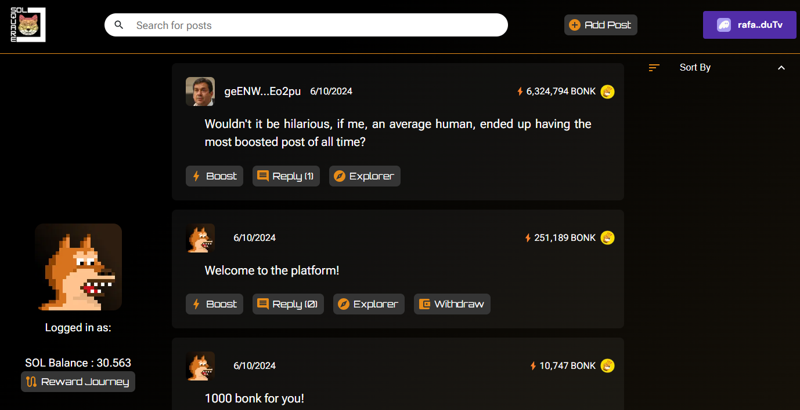
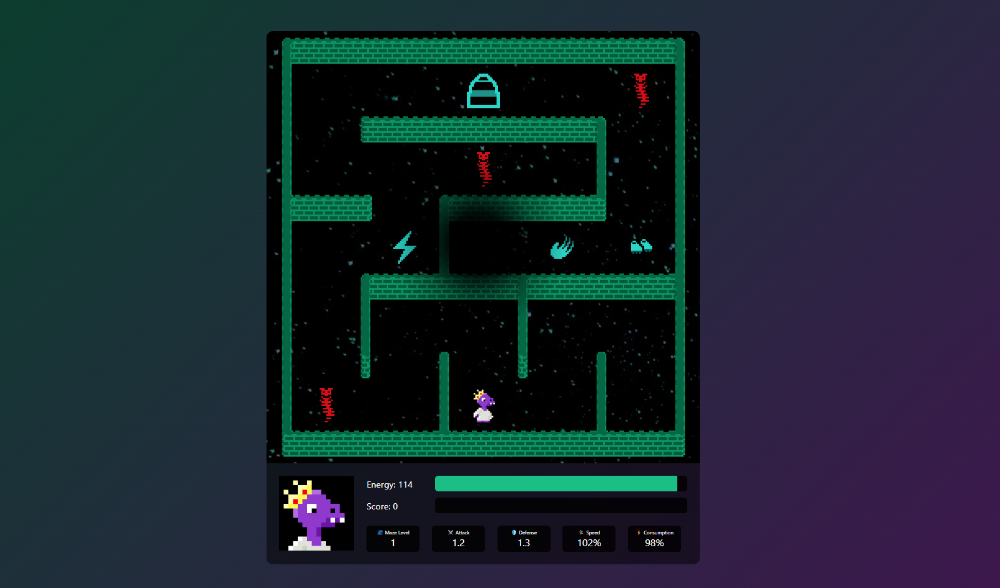
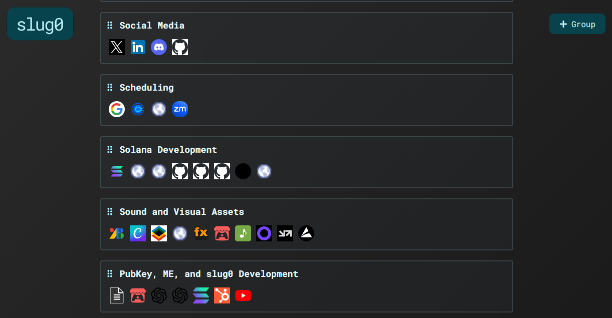
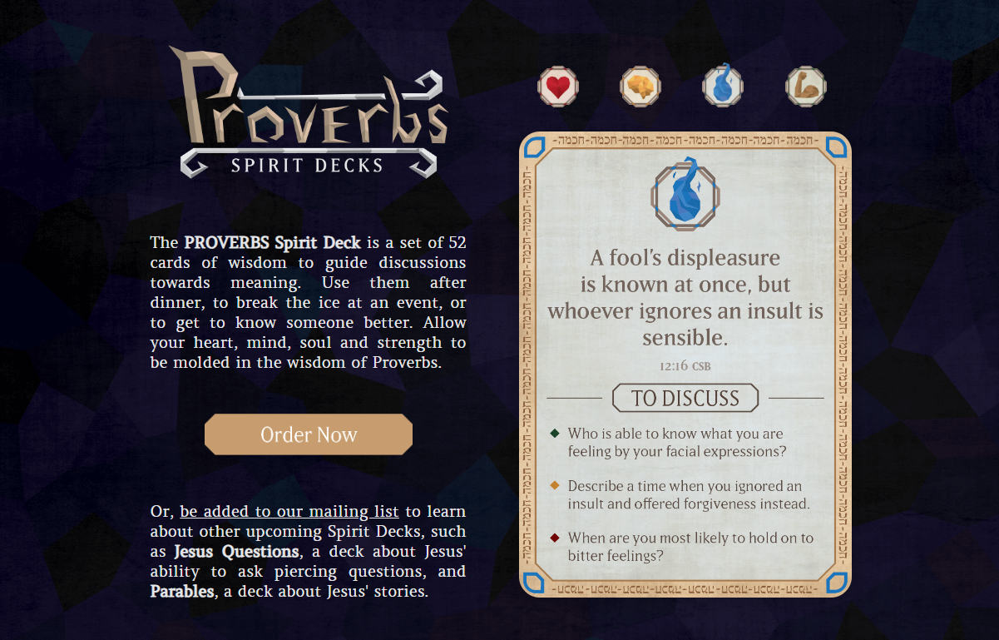
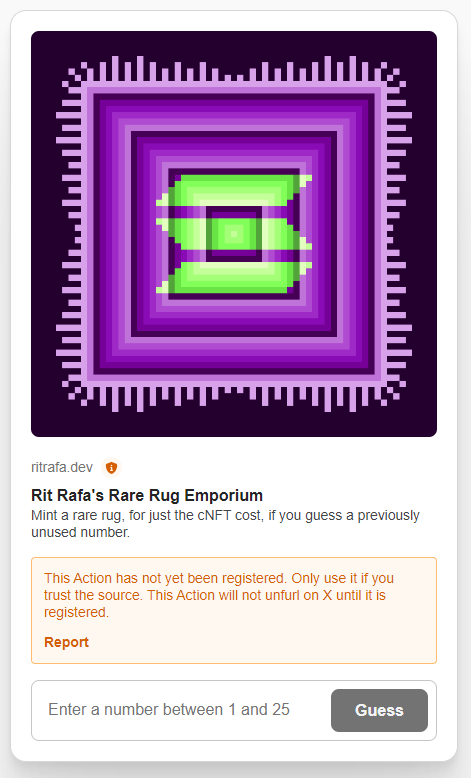
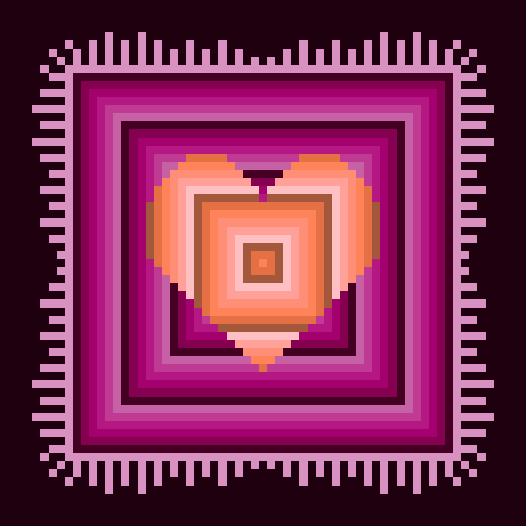

# Introduction

This repo showcases work done for the WBA Turbine 2024 Q3 Cohort, as well as some other related Solana and frontend development work. I am open for work; you can reach me via:

> X: [@RitRafa](https://www.x.com/RitRafa) | Discord: ritrafa | Email: [rit.rafa1@gmail.com](mailto:rit.rafa1@gmail.com)

# General Portfolio

## Writing Samples

- [Learning from Losing a Hackathon](https://x.com/RitRafa/status/1817996818787324405)
- [Got Wallet? 4 Strategies for Solana dApps](https://x.com/RitRafa/status/1816269526079607118)
- [Reflecting on Solana Speedrun](https://x.com/RitRafa/status/1809657939701166182)
- [Introducing Manic Entanglement](https://x.com/RitRafa/status/1807165635220090937)

## Bonkathon Submission - SOLSQUARE

[SOLSQUARE Live Devnet Site](https://solsquare.net) | [Github](https://github.com/altaga/SolSquare)

SolSquare is a decentralized social media that promotes economic incentives for good behavior powered by BONK and AI rudeness detection. This was created with an incredible team (see Github), first as our Encode bootcamp capstone project and then as a Bonkathon submission. While we didn't win, we ended up with some incredible [lessons learned](https://x.com/RitRafa/status/1817996818787324405).

## Solana Speedrun 3 Submission - Manic Entanglement

[Live Site](https://manic-entanglement.com) | [Github](https://github.com/ritrafa/manic-entanglement)

Created as an entry for Solana Speedrun 3, this game was created in one week. Every step you take reshuffles the maze, and every power-up you pick up gives perpetual boosts.

Are you ready to dive into an ever-shifting labyrinth where survival is fleeting, and wisdom and prior attempts are your greatest assets? Welcome to Manic Entanglement, a rogue-lite game on Solana where every step you take alters the labyrinth, challenging your wits and reflexes while you collect gear and items to stave off your eventual return to the cosmic mist. Each time you re-enter, you do so a little wiser, a little stronger and better prepared for the infinite entanglement.

This uses next.js, metaplex core, and pinata ipfs, and any playable nft loads as a separate animated playable character! I did ever part of this (dev, front end, pixel art) with the exception of the music.

## Bookmark Manager - slug0

[Live Site](https://slug0.net) | Closed Source (happy to share)

This custom bookmark manager was made over a weekend because I wasn't happy with the market alternatives. It includes AI generated link groups, the ability to produce shortened urls, and share sets of links. Cleanly sortable and built for mobile & desktop.

## Product Page - Spirit Decks

[Live Site](https://spiritdecks.com) | Closed Source (happy to share)

This is a site I built for a physical product I created with my wife and our graphic designer. It is a set of cards that prompt discussion on various Proverbs, used to teach wisdom. The site include 3d card samples.

# Turbin3 Work

## Necessary Run Tasks for Turbin3

1.  Standard install of necessary modules

        npm install --force // Or fix depedents

2.  Add a wba-wallet address private key locally, and double check <code>.gitignore</code> based on your wallet file naming convention
3.  After updating any ts files, use <code>npm run {name in package.json scripts}</code> to run them

        cd ts
        npm run spl_init

## Prerequisite Task

In the prerequisite task for the Turbin3 cohort, we used typescript to generate a keypair, airdrop to that wallet, transfer sol, and enroll to the WBA registration program.

Folder:

    prereq-airdrop

## Rust Registration

In the registration task, we used rust to generate a keypair, airdrop to that wallet, swap between wallet keys and b58, transfer sol, and enroll to the WBA registration program.

Folder:

    rust-registration

## 240730 - Class 1

In Class 1 we created a working token initizalizer, created the associated token account (ATA) within our own wallet for that token, then minted tokens into that ATA. I used the following during the class for additional [documentation](https://spl.solana.com/token).

Files:

    ts\cluster1\spl_init.ts
    ts\cluster1\spl_mint.ts

Here is the final [transaction](https://explorer.solana.com/tx/54F32PnGEE2vAeNau2sJwanpYwrfHBSqRkZKevN9nQs13TFiZErDvp2vjWPopg1s7rNZU61CBrtCYsWr9eqxLBNs?cluster=devnet) of this class' work, which is the mint tx.

## 240731 - Class 2

After class 2, we proceeded with adding metadata to our spls then transferred them on to classmates.

Files:

    ts\cluster1\spl_metadata.ts
    ts\cluster1\spl_transfer.ts

## 240801 - Class 3

In class 3, we tested out the metaplex nft irys upload and mint features. I added an animation to my rug via Aseprite.

Files:

    ts\cluster1\nft_image.ts
    ts\cluster1\nft_metadata.ts
    ts\cluster1\nft_mint.ts

## 240804 - Weekend Blink Bonus

Over the weekend, I build a blink that allowed the mint of one of 25 animated rugs. The special gimmick of the blink is that it forced someone to guess a number that had not yet been used. Once any guess was made, they would need to wait 1 minute before it allowed another guess.

To make it not enforce any payments, if someone submitted a correct guess, I sent them the core nft, but then requested a transfer to cover mint costs. Given the small size of the the test group I was ok even if I didn't recoup all the mint costs.

[x Post](https://x.com/RitRafa/status/1820512886474805508)

In retrospect, I wish I had made the batch size slightly bigger, and reworded the x post to help it gain more virality. I have noticed that when I present things as tests/for fun, they typically receive slightly less tractions.

Files:

    ts\cluster1\nft_core_collection.ts
    ts\cluster1\nft_rug_mint.ts
    blink\app\actions.json\route.ts
    blink\api\actions\mint\route.ts
